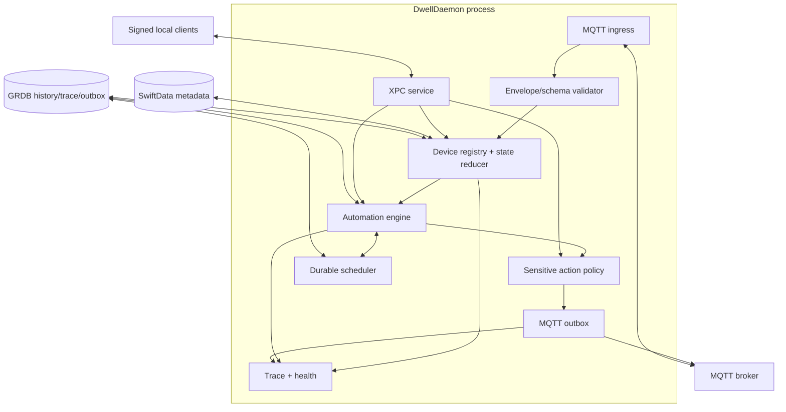
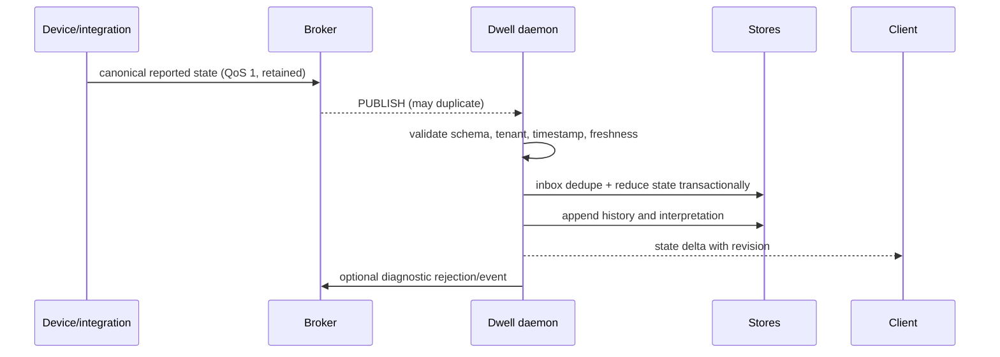
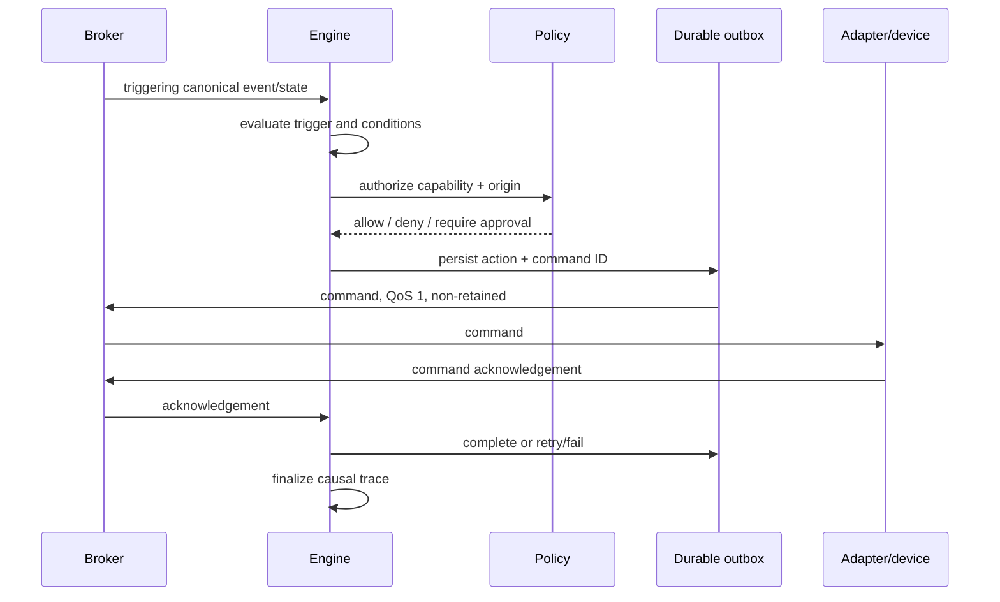
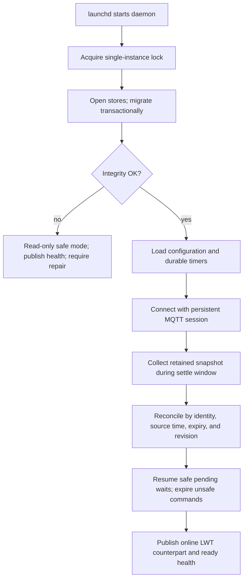
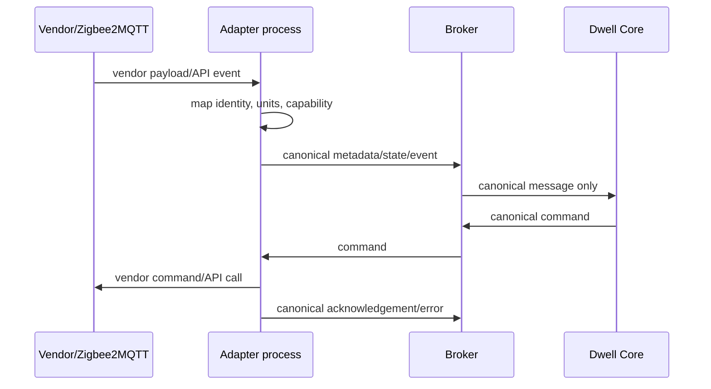
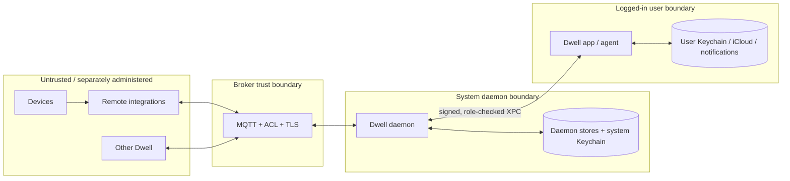
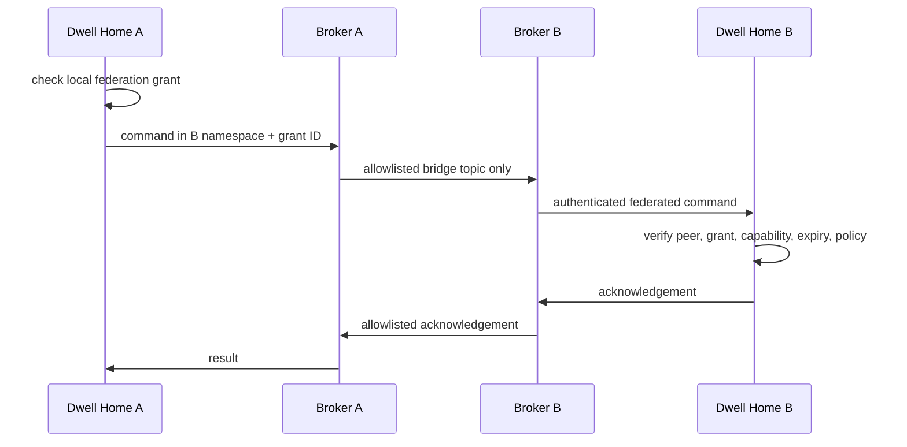

# Dwell architecture and implementation plan

Status: Accepted implementation baseline
Target: macOS 26 and later
Last reviewed: 27 July 2026

This document is the implementation-oriented plan for Dwell. Major choices are also recorded as independently reviewable ADRs in [`adrs/`](./adrs/README.md). “MUST”, “SHOULD”, and “MAY” express design intent, not a published interoperability standard.

The reserved bundle-identifier namespace for all Dwell products, services, extensions, and helpers is `com.hexela.dwell.*`. The main application uses `com.hexela.dwell`, with subordinate targets using stable suffixes such as `com.hexela.dwell.daemon`, `com.hexela.dwell.agent`, and `com.hexela.dwell.widgets`.

The initial release targets Apple silicon only. The public repository is `Hexela/dwell`, administered initially through the `dominictristram` GitHub account, and is public from its first commit. Original Dwell files carry both the MPL 2.0 notice and an appropriate `Copyright © Hexela` notice.

## 1. Executive summary

Dwell is a local-first, native macOS automation authority. A boot-time Swift daemon owns automation execution, canonical MQTT consumption/publication, configuration persistence, history, and audit trails. A SwiftUI app is a management client; closing or crashing it cannot stop automations.

MQTT is the sole device and integration boundary. Dwell Core never calls a vendor API. Adapters translate Zigbee2MQTT, generic topics, and future vendor protocols into Dwell’s versioned JSON envelope and translate canonical commands back out. MQTT is authoritative for reported device facts and actions in flight; the database is authoritative for user intent, configuration, identities, policy, and durable interpretation/history.

The MVP uses:

- a root-owned, least-privileged LaunchDaemon registered with `SMAppService`;
- authenticated local XPC between signed Dwell clients and the daemon;
- MQTT 5 where available, with an MQTT 3.1.1 compatibility profile;
- SwiftData for modest relational configuration and GRDB over SQLite for append-heavy history, traces, timers, and inbox/outbox records;
- compiled first-party adapter executables supervised by the daemon, communicating through MQTT rather than private in-process APIs;
- deterministic, serialisable trigger-condition-action plans with durable waits;
- generated room/device views, guided setup, an MQTT Inspector, and friendly causal explanations.

The first release deliberately excludes a dashboard designer, arbitrary scripts, third-party in-process plug-ins, a companion app, cloud-dependent automation, video, and an Apple Home bridge. Apple Home exposure is a research track because public controller APIs do not make a general software accessory bridge available; distributable HomeKit accessories require MFi participation, while Matter products require CSA certification.

## 2. Product goals

1. Keep a single home operating through GUI quit, logout, daemon crash, network interruption, broker restart, and Mac restart.
2. Make common setup and automation tasks graphical and understandable.
3. Normalize all device interaction through a documented MQTT contract.
4. Explain every automation decision from input through acknowledgement.
5. Be secure by default, especially for locks, doors, alarms, gates, and heating protections.
6. Work with existing Mosquitto and Zigbee2MQTT installations.
7. Keep ordinary operation local and avoid a mandatory Dwell service.
8. Create stable seams for remote integrations, federation, and future Apple-platform clients.
9. Ship a modest, testable open-source product before broad ecosystem coverage.

Success means a non-specialist can connect a broker, import a Zigbee2MQTT sensor and light, place them in a room, create “movement after sunset turns on the light,” and later understand why it did or did not run.

## 3. Explicit non-goals

The MVP will not:

- match Home Assistant’s integration catalogue or templating language;
- supervise Zigbee2MQTT, become a full broker administrator, or own a Matter fabric;
- support multiple homes in one installation;
- run arbitrary user code, JavaScript, shell commands, or untrusted binary plug-ins;
- offer custom dashboard layout, video recording, voice-assistant infrastructure, or an iOS/iPadOS app;
- use iCloud for real-time control;
- promise exactly-once physical effects (MQTT cannot provide that);
- expose non-Apple devices to Apple Home until a supported and distributable route is proved;
- make remote Internet access automatic.

## 4. User personas and initial deployment assumptions

**Household administrator.** Installs Dwell, approves its daemon, connects integrations, assigns rooms, grants sensitive permissions, and diagnoses failures.

**Household member.** Uses favourites, scenes, notifications, and understandable activity without seeing broker details.

**Advanced MQTT user.** Maps an unknown topic, inspects payloads, exports diagnostics, and may deploy remote adapters.

**Integration developer.** Implements a manifest and a process that speaks an external protocol on one side and canonical MQTT on the other.

Assumptions:

- one authoritative installation per home, on an always-on Mac;
- one broker reachable locally, possibly on another host;
- system time and timezone are maintained;
- initial administration occurs in a logged-in session, but execution does not;
- the daemon can run without user-scoped HomeKit, notifications, iCloud, or login Keychain access;
- IDs are opaque lowercase UUID strings; user-facing names are never protocol identity.

## 5. Key architectural principles

1. **MQTT boundary, not MQTT-shaped internals.** Core consumes typed canonical messages through an ingress port. Vendor topics stay in adapters.
2. **Facts versus intent.** Reported state is a device fact; commands are desired effects and never silently become reported state.
3. **One writer for durable core state.** The daemon owns databases; clients use IPC and immutable snapshots.
4. **At-least-once by design.** Every consumer tolerates duplication; effectful commands carry stable IDs and expire.
5. **Explainability is execution data.** Tracing is produced during evaluation, not reconstructed from logs.
6. **Least privilege and explicit capability grants.** Interfaces cannot bypass policy.
7. **Failure containment.** Adapters and optional surfaces cannot crash or stall automation.
8. **Declarative before executable.** Rules and mappings are versioned data validated before activation.
9. **Local-first, federation-explicit.** No ambient trust between installations.
10. **Evolution through versioned contracts.** Payload schema, database schema, automation AST, IPC, and manifests evolve independently.

## 6. Recommended high-level architecture

```mermaid
flowchart LR
    subgraph H["Home LAN"]
      B["MQTT broker"]
      Z["Zigbee2MQTT"]
      R["Remote adapters"]
      O["Other Dwell installation"]
    end
    subgraph M["Always-on Mac"]
      D["Dwell daemon"]
      DB[("Config + history stores")]
      A["First-party adapter processes"]
      X["Authenticated XPC API"]
      U["Dwell SwiftUI app"]
      G["Login agent\nnotifications/menu bar"]
      W["Widgets / App Intents"]
      C["dwellctl diagnostics"]
    end
    Z <--> B
    R <--> B
    O <--> B
    A <--> B
    B <--> D
    D <--> DB
    D <--> X
    X <--> U
    X <--> G
    X <--> W
    X <--> C
```



The daemon contains orchestration, not vendor logic. Its internal ports are MQTT transport, state registry, automation engine, policy engine, history, scheduler, and client API. The broker may be local or remote and is not embedded in the daemon.

## 7. Process and background-service architecture

### Security contexts and launch

`DwellDaemon` is a LaunchDaemon registered from the signed app bundle with `SMAppService.daemon(plistName:)`. Apple documents that approved LaunchDaemons bootstrap on subsequent boots and require administrator approval ([SMAppService](https://developer.apple.com/documentation/servicemanagement/smappservice), [registration behavior](https://developer.apple.com/documentation/servicemanagement/smappservice/register())). It runs as a dedicated `_dwell` account when installer/distribution mechanics permit; the fallback is root startup followed immediately by dropping groups, UID, and unnecessary rights. It must not run as the interactive user. The project has an Apple Developer account intended to own and sign `com.hexela.dwell`; the concrete Team ID and designated requirements must be captured in private release configuration before the signed daemon/XPC spike is complete.

`DwellAgent` is an optional per-user LaunchAgent. It owns notification authorization, menu-bar UI, user-presence hooks, and future iCloud or HomeKit controller access. It is not an automation authority. `Dwell.app`, widgets, App Intents, AppleScript, and `dwellctl` are clients.

### Storage and secrets

- `/Library/Application Support/Dwell/`: daemon-owned configuration database, history database, schema resources, adapter manifests, and non-secret installation public identity.
- `/Library/Logs/Dwell/` or unified logging: structured operational logs with privacy markings.
- user app container: window state, UI preferences, cached read-only snapshots.
- daemon credentials: a daemon-accessible system Keychain item installed through an authorized flow. Never assume a root daemon can reuse a user’s unlocked login Keychain.
- user-scoped tokens: user Keychain, consumed only by the agent/adapter that owns them.

No writable shared database is placed in an App Group between daemon and app. XPC prevents schema coupling and enforces authorization.

### IPC

Use a Mach XPC service exposed by the daemon. Validate the connecting process’s audit token, Team ID, signing requirement, protocol version, role, and requested operation. Each request includes an idempotency key; subscriptions stream bounded state/trace deltas with resume cursors. Mutations return accepted/rejected plus revision. The GUI never publishes device commands directly to MQTT.

Widgets and App Intents call a narrow agent/client façade: read favourites, activate an allowed scene, toggle an ordinary capability, or enqueue a confirmed intent. They cannot evaluate rules or read secrets. If the daemon is unavailable, they fail clearly rather than simulating success.

### Lifecycle, upgrades, and crashes

- `launchd` starts the daemon at boot, keeps it alive, and applies throttling to crash loops.
- The daemon writes an atomic “ready” state only after database migration, broker client initialization, and reconciliation.
- App updates carry daemon and plist in the bundle. Registration uses `BundleProgram`; protocol handshakes reject incompatible clients.
- Before an update, drain new work, checkpoint the SQLite WAL, stop adapters, replace signed artifacts, restart, migrate transactionally, then reconcile.
- Keep one backward-readable database version for rollback; never downgrade after a destructive migration without a backup.
- Collect `Logger`/`OSLog` events, crash reports, database integrity results, and a redacted configuration inventory into a user-approved diagnostics bundle.

### System-level versus user-level facilities

The daemon does not directly post user notifications, access iCloud, or assume Apple Home permissions. It writes notification requests to a durable queue. Each authorized `DwellAgent` claims and presents appropriate requests and returns acknowledgement. Future HomeKit/iCloud functionality runs in the user context and bridges only canonical MQTT/IPC messages. Core automation remains correct if no agent is logged in.

## 8. Component diagram



## 9. Data-flow diagrams

### Normal inbound state update



### Automation command



### Startup and recovery



### Integration-to-MQTT flow



## 10. Trust-boundary diagram



Broker authentication proves a principal, not payload truth. Every canonical message is authorized against topic installation, source integration, entity ownership, schema, and permitted message kinds.

## 11. MQTT canonical topic and payload specification

### Version and hierarchy

JSON is the v1 encoding: inspectable, widely supported, and adequate at household scale. UTF-8 JSON, maximum 256 KiB (default 64 KiB), no NaN/Infinity, RFC 3339 UTC timestamps with fractional seconds, and canonical unit identifiers. Binary data is referenced by authenticated URL or opaque object ID, never embedded.

```
dwell/v1/i/<installationID>/device/<deviceID>/component/<componentID>/metadata
dwell/v1/i/<installationID>/device/<deviceID>/component/<componentID>/state/<capability>
dwell/v1/i/<installationID>/device/<deviceID>/component/<componentID>/command/<capability>
dwell/v1/i/<installationID>/device/<deviceID>/component/<componentID>/ack/<capability>
dwell/v1/i/<installationID>/device/<deviceID>/component/<componentID>/event/<eventType>
dwell/v1/i/<installationID>/device/<deviceID>/availability
dwell/v1/i/<installationID>/integration/<integrationID>/metadata
dwell/v1/i/<installationID>/integration/<integrationID>/discovery
dwell/v1/i/<installationID>/integration/<integrationID>/status
dwell/v1/i/<installationID>/scene/<sceneID>/command
dwell/v1/i/<installationID>/notification/request
dwell/v1/i/<installationID>/automation/<automationID>/event
dwell/v1/i/<installationID>/system/status
```

Topic versions define routing compatibility; `schema` defines payload compatibility. IDs are restricted to `[a-z0-9][a-z0-9-]{0,63}`. Capability names are registered lowercase dotted identifiers such as `sensor.temperature`, `light.on`, `light.brightness`, and `lock.secured`.

All payloads share:

```json
{
  "schema": "io.dwell.state.temperature/1.0",
  "messageId": "019c...",
  "source": {"installationId": "home-a", "integrationId": "zigbee-main"},
  "observedAt": "2026-07-26T20:14:32.481Z",
  "publishedAt": "2026-07-26T20:14:32.612Z",
  "sequence": 1842,
  "quality": {"status": "good", "confidence": 1.0},
  "correlationId": "019c...",
  "causationId": "019c...",
  "body": {}
}
```

`messageId` deduplicates delivery. `sequence` is monotonic only within a documented source stream and is not global ordering. `observedAt` is event time; `publishedAt` diagnoses delay. `quality.status` is `good|uncertain|stale|invalid|unavailable`. Unknown additive fields are ignored. Consumers reject unsupported major schemas and tolerate supported-minor additions.

### Retain, QoS, expiry, and availability

| Message | QoS | Retain | Notes |
|---|---:|---:|---|
| metadata/discovery | 1 | yes | Tombstone with zero-byte retained publish on removal |
| current state | 1 | yes | Includes observation time and optional `validForSeconds` |
| availability/status | 1 | yes | LWT publishes `offline`; online overwrites it |
| command | 1 | no | Has expiry, idempotency key, expected-state precondition |
| acknowledgement | 1 | no | Durable consumer session; optionally summarized in command history |
| transient event | 1 | no | Dedupe by message ID |
| automation trace event | 1 | no | Database is durable record |

MQTT 5 is preferred, and MQTT 3.1.1 compatibility is an MVP requirement. MQTT 5 clients use session expiry, message expiry, response topic/correlation data where helpful, and retained-message flags. MQTT 3.1.1 clients carry correlation, causation, expiry, response routing, and equivalent application semantics in the JSON envelope; the compatibility profile and tests must define any broker-level behavior that cannot be reproduced. MQTT’s standard makes retained messages independent of session state and provides session/message expiry ([OASIS MQTT 5.0](https://docs.oasis-open.org/mqtt/mqtt/v5.0/mqtt-v5.0.html)); Dwell still enforces application freshness.

QoS 2 is not the default: it adds handshake cost and still cannot make a physical device effect exactly once. Commands are QoS 1 plus application idempotency. An adapter keeps a bounded command-ID cache and returns the previous result for duplicates. Non-idempotent actions require an adapter-defined strategy and are never automatically retried after an ambiguous timeout.

### Examples

Temperature:

```
Topic: dwell/v1/i/home-a/device/hall-sensor/component/climate/state/sensor.temperature
{"schema":"io.dwell.state.quantity/1.0","messageId":"01-temp","source":{"installationId":"home-a","integrationId":"zigbee-main"},"observedAt":"2026-07-26T20:14:32Z","publishedAt":"2026-07-26T20:14:33Z","quality":{"status":"good","confidence":0.99},"body":{"value":21.4,"unit":"cel"}}
```

Dimmable light (two capabilities may be published independently):

```
.../device/kitchen-pendant/component/main/state/light.brightness
{"schema":"io.dwell.state.level/1.0",...,"body":{"value":0.72,"range":{"minimum":0,"maximum":1}}}
```

Occupancy:

```
.../device/hall-pir/component/main/state/occupancy.detected
{"schema":"io.dwell.state.boolean/1.0",...,"body":{"value":true,"validForSeconds":90}}
```

Door lock:

```
.../device/front-lock/component/bolt/state/lock.secured
{"schema":"io.dwell.state.enum/1.0",...,"body":{"value":"secured","allowed":["secured","unsecured","jammed","unknown"]}}
```

Availability:

```
.../device/front-lock/availability
{"schema":"io.dwell.availability/1.0",...,"body":{"status":"online","since":"2026-07-26T19:00:00Z","reason":null}}
```

Command:

```
.../device/kitchen-pendant/component/main/command/light.brightness
{"schema":"io.dwell.command/1.0","messageId":"01-cmd","correlationId":"01-run","source":{"installationId":"home-a","integrationId":"dwell-core"},"publishedAt":"2026-07-26T20:15:00Z","body":{"commandId":"01-cmd","operation":"set","value":0.35,"expiresAt":"2026-07-26T20:15:10Z","expected":{"revision":418},"origin":{"kind":"automation","id":"evening-light"},"risk":"ordinary"}}
```

Acknowledgement:

```
.../device/kitchen-pendant/component/main/ack/light.brightness
{"schema":"io.dwell.command-ack/1.0","messageId":"01-ack","correlationId":"01-run","causationId":"01-cmd","source":{"installationId":"home-a","integrationId":"zigbee-main"},"publishedAt":"2026-07-26T20:15:01Z","body":{"commandId":"01-cmd","status":"applied","resultingState":{"value":0.35},"error":null}}
```

Integration discovery:

```
dwell/v1/i/home-a/integration/zigbee-main/discovery
{"schema":"io.dwell.discovery/1.0",...,"body":{"device":{"nativeId":"0x00158d...","manufacturer":"Acme","model":"TH-1"},"components":[{"nativeId":"climate","capabilities":["sensor.temperature","sensor.humidity"]}]}}
```

Automation-generated action event:

```
dwell/v1/i/home-a/automation/evening-light/event
{"schema":"io.dwell.automation-event/1.0",...,"body":{"runId":"01-run","phase":"action-published","commandId":"01-cmd","summary":"Set Kitchen Pendant to 35%"}}
```

Federated command uses the target installation’s namespace, a federation principal restricted by ACL, and provenance:

```
dwell/v1/i/cottage/device/porch-light/component/main/command/light.on
{"schema":"io.dwell.command/1.0",...,"source":{"installationId":"home-a","integrationId":"federation-cottage"},"body":{"commandId":"01-fed","operation":"set","value":true,"expiresAt":"2026-07-26T20:15:10Z","origin":{"kind":"federation","installationId":"home-a"},"grantId":"grant-porch-control","risk":"ordinary"}}
```

## 12. Third-party MQTT adaptation strategy

Adapters subscribe to third-party topics, normalize identity/units/semantics, and publish canonical topics. Reverse mappings consume canonical commands and publish vendor commands. Core subscribes only to `dwell/v1/...`.

- **Generic MQTT:** declarative mappings owned by `DwellGenericAdapter`.
- **Zigbee2MQTT:** recognize bridge/device topics, exposes metadata, availability, and device `exposes`; maintain a tested converter registry.
- **Home Assistant Discovery:** import discovery metadata as a hint, not an enduring dependency. Preserve the source config for diagnostics; translate supported components.
- **Mosquitto:** broker only; use `$SYS` data optionally for diagnostics, never as device state.
- **Tasmota, Shelly, ESPHome, Homie:** future dedicated mapping packs/adapters.
- **Sparkplug:** defer; its industrial namespace/session/state semantics merit a separate adapter, not partial generic support.

An adapter conformance kit provides golden input/output fixtures, retained-message behavior tests, duplicate command tests, schema validation, and simulated broker scenarios. Unknown fields remain available as raw diagnostics but do not leak into Core models.

## 13. Integration architecture comparison

| Model | Isolation | Remote | Native setup | Updateability | Decision |
|---|---|---|---|---|---|
| Compiled into Core | poor | no | excellent | tied to Core | reject for vendor logic |
| Swift helper app | good | no | excellent | moderate | use for user-scoped Apple features |
| XPC service | good on Mac | no | excellent | tied/signing-sensitive | use for privileged/local control, not protocol |
| CLI helper supervised by Dwell | good | no | schema-driven | good | MVP first-party adapters |
| Sandboxed plug-in | uncertain/complex | no | variable | good | defer |
| Independent MQTT service | excellent | yes | declarative/remote | excellent | primary public model |
| Hybrid | good | yes | excellent | good | recommended |

Dynamic libraries and in-process plug-ins are excluded: ABI, trust, crash, and privilege risks outweigh latency benefits.

## 14. Recommended integration model

The public integration contract is MQTT plus a signed JSON manifest. First-party local adapters are separate executables, launched with an unprivileged identity and a generated broker credential restricted to their topics. Remote adapters are operationally identical except Dwell does not supervise them.

Manifest fields:

```json
{
  "manifestVersion": 1,
  "identifier": "io.dwell.zigbee2mqtt",
  "name": "Zigbee2MQTT",
  "version": "1.0.0",
  "developer": {"name": "Dwell Project", "signingIdentity": "..."},
  "minimumDwellVersion": "1.0.0",
  "execution": {"kind": "managedExecutable", "entrypoint": "DwellZigbeeAdapter"},
  "schemas": {"publishes": ["io.dwell.state.quantity/1"], "consumes": ["io.dwell.command/1"]},
  "capabilities": ["discovery", "state", "commands"],
  "permissions": {"network":["local"],"mqtt":["zigbee2mqtt/#"],"secrets":["brokerCredential"]},
  "configurationSchema": "configuration.schema.json",
  "healthTopic": "dwell/v1/i/{installation}/integration/{id}/status"
}
```

Setup is declarative JSON Schema plus Dwell UI hints (secret, host, port, choice, device picker, validation action). Advanced first-party adapters MAY supply a signed custom SwiftUI setup extension in the management app, but the stored configuration remains schema-valid and remotely administrable.

Health includes lifecycle state, last event, connection state, version, restart count, degraded reasons, and permissions. Exponential restart backoff stops at quarantine after a crash threshold. Revoking an integration removes its broker ACL/credential and stops its local process.

## 15. Domain model

User language is **Home → Area → Room → Device → Feature**:

- **Home:** installation’s household metadata, timezone, coordinates (optional and protected).
- **Area:** optional floor/zone grouping; rooms may belong to one area.
- **Room:** primary location assignment.
- **Person:** consented household identity, not an account.
- **Device:** physical/logical product with stable Dwell ID and one owning integration.
- **Component:** independently addressable endpoint, e.g. gang 1, thermostat zone, lock bolt.
- **Capability:** typed state/action contract, e.g. temperature reading or brightness control.
- **Feature:** UI-facing projection of one or more capabilities; avoids exposing protocol jargon.
- **Scene:** named, policy-checked set of desired actions.
- **Automation:** versioned rule definition and enabled revision.
- **Integration:** adapter instance and permissions.

Identity uses `(installationID, integrationID, nativeDeviceID, nativeComponentID)` as a source key mapped to immutable Dwell IDs. A device may have aliases, but renames never change IDs/topics. Replacement creates a new device and an explicit “replace” operation transfers room, friendly name, compatible scene targets, and optionally automation references after preview. It never merges history silently.

Duplicate discovery is proposed to the user using serial/MAC/model evidence. Only explicit merge creates a composite device. Cross-installation entities are local proxy records with remote installation ID, remote entity ID, grant ID, cached state, and freshness.

A smart plug is one device with a relay component and metering component; a multi-gang switch has components per gang; a doorbell has motion, button, camera-reference, and battery features. Room assignment defaults at device level and can be overridden per component.

People and presence are distinct:

- named person presence (`home|away|unknown`) requires consent;
- anonymous home/room occupancy represents sensor evidence;
- trackers are evidence sources, not people;
- inference records confidence, contributors, observation time, and expiry.

Conflicts reduce confidence or yield `unknown`; stale “home” must not persist indefinitely. Raw location history is off by default and never required for occupancy rules.

## 16. Persistence architecture

### Authority matrix

| Data | Authority | Cached elsewhere |
|---|---|---|
| device-reported state/event/availability | canonical MQTT source | interpreted current state + history DB |
| action request/acknowledgement | canonical MQTT plus outbox/inbox record | trace/history |
| installation identity, rooms, names, people | metadata DB | optional metadata publications |
| mappings/integrations/permissions | metadata DB | adapter config and broker ACL projection |
| automations/scenes/variables | metadata DB | immutable execution plans |
| current interpreted state | derived DB cache | retained MQTT helps rebuild |
| history/traces/timers/outbox | history/operational DB | optional export |

**Decision:** SwiftData for user-authored metadata and GRDB/SQLite for append-heavy operational data. Apple positions `ModelContainer` as schema/storage/migration management and supports explicit migration plans ([Apple SwiftData documentation](https://developer.apple.com/documentation/swiftdata/modelcontainer)). It is suitable for the relational configuration graph, but configurable time-series retention, bulk inserts, partial indexes, WAL tuning, and predictable SQL migrations favor GRDB.

GRDB is an approved dependency, not an irreversible storage contract. Keep `HistoryStore`, inbox/outbox, scheduler, and migration behavior behind Dwell-owned protocols and conformance tests. If an implementation spike identifies a material correctness, maintenance, licensing, performance, or platform-support problem, replace GRDB through a superseding ADR; do not let GRDB-specific types cross module boundaries.

Comparison:

- SwiftData: excellent SwiftUI integration and small object graph; less direct operational control.
- SQLite direct: maximum control, unnecessary boilerplate/risk.
- GRDB: typed SQL, migrations, observations, and performance control; one dependency.
- PostgreSQL: strong scale/concurrency but unacceptable MVP operations burden.
- Hybrid: best fit; costs two migration systems and forbids cross-store transactions.

Mitigate cross-store consistency with IDs and an operational outbox, not cross-store foreign keys. Configuration changes commit in SwiftData, then a resumable projection job updates execution snapshots. Active automation revisions are immutable blobs also copied into the operational DB before activation.

### Reconciliation

At startup, subscribe before declaring readiness, collect retained state for a bounded settle window, then compare source identity, timestamp, expiry, sequence (within source), and stored revision. Retained state older than its freshness policy is displayed stale and cannot satisfy freshness-sensitive conditions.

Discovery upserts source keys. Missing devices are not deleted; they become “not seen” then “offline.” Explicit retained tombstones mark source removal and begin a user-reviewable orphan period. Integration reconfiguration creates a new source epoch, preventing old retained data from outranking new observations. Renames affect metadata only.

## 17. Historical-data architecture

GRDB tables partition logically by month (or use indexed timestamp ranges in the MVP):

- `state_samples(entity_id, capability, observed_at, received_at, value_type, numeric_value, text_value, quality, message_id)`
- `events`, `automation_runs`, `trace_spans`, `commands`, `acks`, `notifications`
- `hourly_aggregates` and `daily_aggregates`
- `retention_policy`, `maintenance_checkpoint`

MVP stores changes, not every duplicate publication. Defaults: raw numeric/categorical state 90 days, events and automation traces 180 days, hourly aggregates 2 years, daily energy aggregates retained until changed by the user. Per-capability policies cap age and bytes. Energy counters retain resets and source readings; derived deltas flag gaps and invalid decreases.

Numeric downsampling stores count/min/max/mean/first/last and quality counts. Categorical aggregation stores duration per state and transition count. Gaps are explicit; interpolation is a UI choice, never stored as fact. Maintenance runs incrementally under an I/O budget: checkpoint WAL, aggregate completed buckets, delete only aggregates-verified raw rows, then vacuum opportunistically.

Exports are CSV/JSON with timezone and units, plus a privacy preview. Video/audio and high-frequency telemetry are not history values. The UI initially provides recent charts, event timeline, gaps, and retention controls; arbitrary analytics are deferred.

## 18. Automation-engine design

### Representation

Use a versioned, serialisable declarative AST wrapped as a graph only for editor layout:

```text
AutomationDefinition
  metadata + formatVersion
  trigger: TriggerExpr (one or any-of)
  condition: PredicateExpr (and/or/not/leaf)
  actions: [ActionNode]
```

`ActionNode` supports command, scene, notification, delay, wait-until, variable assignment, choose, and bounded repeat in later versions. Node IDs are stable. Edges capture visual order/branches. The executable plan is a validated immutable compilation of the AST; never decode arbitrary Swift types from untrusted input.

Three editors share the same AST. Wizard-compatible rules carry a computed `simpleProfile`. A flow edit that adds an unsupported construct makes the wizard read-only with “Open in Flow Editor”; it never discards nodes. The structured editor edits a schema-validated JSON/YAML projection with lossless node IDs. Saving always previews semantic changes and creates a new revision.

### Semantics

- Triggers: state transition, numeric crossing with hysteresis, event, time/calendar, sunrise/sunset offset, occupancy, manual.
- Conditions: state/value/freshness, time window, sun, occupancy, variable, availability, cooldown, policy.
- Actions: canonical command, scene, notification, delay/wait, variable.
- Time is injected through `DwellClock`; astronomical calculations use stored coordinates/timezone and record inputs.
- Each trigger produces a `runID`, input snapshot revision, causation ID, and immutable rule revision.
- Concurrency modes: `single`, `restart`, `queued(limit)`, `parallel(limit)`; default `single` with one coalesced retrigger.
- Debounce belongs to trigger semantics; cooldown is checked and recorded after a defined point (default successful action dispatch).
- Delays/waits persist deadline, predicate, rule revision, and continuation token. On restart, overdue delays resume; waits re-evaluate current state. Sensitive or expired continuations fail closed.
- State updates are reduced per entity in mailbox order. Cross-entity atomicity is not promised; each run captures observed revisions.
- Action conflicts are allowed but surfaced as causal chains; an optional per-capability arbitration window can warn before creation. No hidden “last automation wins” guarantee.
- Loops are bounded by causation depth, repeated command fingerprint, per-automation rate limit, and global circuit breaker.
- Commands use expiry, expected revision where safe, retry class, and acknowledgement deadline.
- `unavailable` causes skip, wait, or bounded retry according to explicit action policy.
- Dry run evaluates against a snapshot, produces a trace, and never publishes.

Crash safety uses inbox → state reduction → run scheduling and command outbox transactions in the operational SQLite store. A published-but-unrecorded ambiguity is resolved using stable command IDs. Non-idempotent ambiguous commands become `unknownOutcome`, never blind retry.

## 19. Automation explanation and tracing model

Every run emits a causal tree:

```text
Trace
 ├─ input message + interpreted transition
 ├─ trigger evaluation
 ├─ condition nodes (inputs, result, reason)
 ├─ policy decision
 ├─ action nodes (planned/skipped/published)
 ├─ MQTT publication + command ID
 ├─ acknowledgement/resulting state
 └─ subsequent conflicting actions linked by entity/correlation
```

Each span has `traceID`, `spanID`, `parentSpanID`, `correlationID`, `causationID`, node ID, monotonic start/end, wall-clock time, input revisions, redacted values, outcome, and stable reason code. Friendly explanations are localized renderings of reason codes, not generated free text. Technical view exposes topics, schemas, timing, raw payload after redaction, and retry history.

“Why not?” queries retain trigger candidates and failed predicate spans. Example rendering:

> Hall movement was detected at 22:14, but Hall Light was not switched on because illuminance was 78 lx; this automation requires below 50 lx.

Trace storage is bounded and sampled only for high-volume successful state reductions; automation runs, failures, sensitive actions, and policy denials are never sampled within their retention window.

## 20. Security and permissions model

### Controls

- TLS 1.3 preferred, 1.2 minimum; validate hostname and chain. Certificate pinning is optional for managed deployments, with rotation support.
- Unique broker principal per daemon, adapter, and federation peer. ACLs restrict exact installation and direction; no shared household superuser.
- Secrets in appropriate Keychain, never SwiftData, manifests, logs, crash metadata, or diagnostics.
- Local discovery is opt-in during onboarding with the macOS local-network permission description.
- XPC validates code identity and assigns roles; authorization occurs inside the daemon for every operation.
- First-party binaries are signed/notarized; third-party adapter trust and update signature design are deferred, so MVP installs only first-party managed adapters.
- Config export excludes secrets by construction.

### Capability classification

| Class | Examples | Default automation policy |
|---|---|---|
| ordinary | lights, read-only sensors | allowed |
| privacy-sensitive | presence detail, camera snapshot reference | explicit read grant; redact notifications |
| security-sensitive | unlock, garage/gate, alarm mode, access control | explicit per-automation grant and admin approval |
| safety-critical | disabling protections, hazardous equipment | denied unless a separately enabled expert policy supports it |

Permissions bind subject (automation/interface/peer), capability, entity scope, operation, conditions, expiry, and grant revision. Creating or materially editing a sensitive automation requires administrator authentication and a plain-language review. Execution then uses the stored grant without interactive prompts, allowing legitimate unattended rules. Changing target, operation, origin, or risk invalidates the grant.

Siri, widgets, AppleScript, Shortcuts, and federation each have distinct principals. Sensitive commands are denied by default; if enabled, require the strongest confirmation the surface supports and a specific grant. Unlock/open actions never appear in widgets by default. Notifications redact sensitive values on lock screen. All sensitive attempts—allowed or denied—are audited immutably with actor, policy revision, and outcome.

## 21. Reliability and recovery model

Dwell promises durable intent and at-least-once processing within configured retention, not exactly-once physical effect.

- persistent MQTT session and QoS 1 reduce gaps; application inbox handles duplicates;
- retained state accelerates recovery but is checked for timestamp, expiry, source epoch, and sequence;
- integration and device heartbeats drive `online|degraded|offline|unknown`;
- daemon health includes broker, stores, scheduler lag, adapter status, outbox depth, clock changes, and disk pressure;
- degraded mode continues rules whose required facts and outputs are healthy and marks others skipped with reasons;
- retries use exponential backoff with jitter, command expiry, maximum attempts, and capability retry class;
- failed or ambiguous actions enter a reviewable failed-action queue;
- database migration first backs up metadata, runs transactionally, and verifies; failure starts read-only safe mode;
- disk pressure progressively shortens expendable raw history, never configuration/audit without warning;
- clock jumps reschedule wall-clock timers and record the change; monotonic clocks measure durations.

Startup follows the diagram in section 9. A watchdog should be `launchd`, not a second custom authority. A health timer detects internal event-loop stalls and deliberately exits only after flushing diagnostics, allowing `launchd` recovery.

## 22. Cross-installation communication model

Real-time control uses secure MQTT federation, preferably distinct brokers with explicit bridge rules; a shared broker is acceptable for a single administrator but increases blast radius. iCloud/CloudKit may later sync user-approved metadata and pairing records, never commands or automation timing.



Pairing exchanges installation public keys/certificates out of band (QR or authenticated nearby flow) and creates reciprocal, least-privilege grants. Broker ACLs are the outer boundary; signed application envelopes are a later defense-in-depth option for brokers not fully trusted. No wildcard device export. State sharing is an explicit allowlist with rate and history limits.

Division:

- real-time state/control: MQTT federation or user VPN;
- configuration metadata: local, optional CloudKit later;
- discovery/pairing: QR/local discovery, optional iCloud rendezvous later;
- history: local; explicit export or future selective replication;
- remote UI: authenticated API over user-managed VPN first; no automatic port forwarding.

## 23. Apple Home/Matter strategy

Stage 1 imports no Apple Home devices and exposes none. Dwell can document that a connector must publish canonical MQTT.

Stage 2 investigates a user-session HomeKit controller integration for reading/controlling accessories already in Apple Home, subject to entitlements, user authorization, and suitability for continuous logged-out operation. It remains an adapter and cannot be the only path for critical automations.

Stage 3 prototypes a standards-compliant Matter bridge only if the public SDK, bridge device types, commissioning, persistent fabric storage, and distribution path are viable. Apple states that Xcode includes a certified Matter SDK, but products distributed or sold as Matter accessories require Connectivity Standards Alliance certification; distributable HomeKit accessories require MFi participation ([Apple Home developer overview](https://developer.apple.com/apple-home/)). HomeKit’s data model recognizes bridges ([bridged accessories](https://developer.apple.com/documentation/homekit/hmaccessory/isbridged)), but controller APIs alone do not authorize a general software accessory implementation.

Therefore:

- do not depend on private HAP implementations or private APIs;
- do not promise App Store distribution for a privileged bridge;
- treat open-source source availability separately from certification and trademark rights;
- keep the bridge out-of-process and MQTT-only if pursued;
- expose only selected capabilities, map identity stably, and apply Dwell sensitive-action policy before forwarding.

## 24. Apple platform integration strategy

- **App Intents/Shortcuts/Siri:** stable operations over XPC: query favourites/status, activate allowed scene, set ordinary feature, enable/disable automation. Entity identifiers are Dwell IDs.
- **Widgets:** timelines show cached snapshots; interactive actions invoke App Intents. No rule evaluation.
- **Spotlight:** index rooms, devices, scenes, and automations—not live sensor values or private traces.
- **Notifications:** daemon queues; user agent posts and returns action/ack.
- **iCloud:** later, opt-in metadata/pairing sync. Never the live bus.
- **AppleScript:** a restrained Dwell app scripting dictionary remains useful for traditional Mac workflows and discoverability; App Intents are better for Siri/Shortcuts and cross-device evolution.
- **Live Activities:** defer. Long-lived home status does not fit a bounded live event; a temporary alarm or lengthy scene could qualify later, but notifications/widgets are clearer.

AppleScript dictionary:

```
application "Dwell"
  rooms, devices, scenes, automations
  state of device
  activate scene
  set enabled of automation
  perform allowed action on device
  system health
end
```

Commands go through the same policy principal; scripts never receive broker credentials or raw secrets.

## 25. UI information architecture

A three-column `NavigationSplitView` uses sidebar → collection/content → inspector:

- Home: favourites, household status, notable activity.
- Rooms: generated feature controls and room history.
- People: privacy-aware presence and evidence freshness.
- Devices: identity, features, availability, history, diagnostics.
- Automations: list, wizard/flow/structured editor, runs.
- Scenes: generated scene editor and activation.
- Activity: friendly timeline with causal drill-down.
- Integrations: catalogue, permissions, setup, health.
- MQTT Inspector: separate technical window when useful.
- Settings: General, Broker, Notifications, Security, History, Updates, Advanced.

Use searchable tables/lists, inspectors for details, toolbar primary actions, context menus, drag room assignment, keyboard commands, VoiceOver labels, reduced motion, and full keyboard navigation. Mutation commands support undo where they are local configuration changes; external device effects are never presented as safely undoable—offer an explicit compensating action instead.

Multiple windows are justified for MQTT Inspector, automation comparison, and diagnostics. Restore navigation but not transient secrets or dangerous command forms. AppKit bridges may be justified for `NSDocument`-like structured editor behavior, advanced table column management, text editing, AppleScript suite plumbing, and system window APIs unavailable in SwiftUI. Prefer SwiftUI otherwise.

## 26. Onboarding flows

First launch is resumable and does not mark Dwell ready until health checks pass:

1. Explain local-first architecture and admin requirement.
2. Name home; set timezone; optionally location for sun times.
3. Add rooms/areas.
4. Register and approve daemon; verify it survives app quit.
5. Discover brokers using Bonjour where advertised and passive recognition where permitted.
6. Manual hostname/port/protocol entry.
7. Test DNS, TCP, TLS chain/hostname, MQTT negotiation, credentials, publish/subscribe loopback, retained capability, and ACL separately.
8. If none exists, offer Mosquitto guidance; present automated installation only when the separately gated stretch feature is available.
9. Detect Zigbee2MQTT/Home Assistant discovery patterns without claiming control.
10. Preview import, duplicates, and capability mappings.
11. Assign devices to rooms.
12. Create a first wizard automation and dry-run it.
13. Authorize notifications through the user agent.
14. Show final daemon/broker/integration/device health.

For the MVP, Dwell discovers likely brokers, detects existing Mosquitto installations where practical, tests connectivity and configuration layers, and provides excellent manual local-installation guidance. Automated Mosquitto installation is a stretch goal and must not block the MVP.

If automated installation is later enabled, it is an explicit admin action. Prefer a signed bundled/installer-managed compatible binary if licensing and updates permit; otherwise guide a package-manager install. Dwell writes only an included minimal config, dedicated credentials, listener, persistence directory, TLS references, and ACL include. It can start/stop only the instance it created. Advanced changes open documentation and mark config as externally managed. Never overwrite an existing Mosquitto config.

Task assistants reuse the same validation steps: Add Device, Connect Integration, Create Automation, Create Scene, Expose to Apple Home (initially availability explanation), Diagnose Offline Device, Reconnect Broker, and Approve Sensitive Capability.

Intent routing examples:

- “I already run Zigbee2MQTT” → broker test → topic detection → Zigbee adapter.
- “I have a Zigbee temperature sensor” → ask whether a Zigbee coordinator/service already exists; explain Dwell does not pair Zigbee itself.
- “I have a Matter device” → explain MVP connector requirement.
- “I have a Ring doorbell” → explain a future external connector must publish MQTT; do not solicit credentials without an integration.

## 27. Generic MQTT mapping workflow

1. Browse/subscribe to a topic in safe read-only mode.
2. Capture bounded, redacted sample payloads.
3. Detect JSON/text/number/boolean.
4. For JSON, display a tree and let the user click fields; produce a restricted JSON Pointer/JSONPath subset.
5. Select Dwell capability, type, unit, enum/boolean mapping, scale/offset, clamp, and invalid-value policy.
6. Select availability topic/value/expiry.
7. Optionally define command topic, JSON shape, acknowledgement or state-confirmation rule.
8. Preview canonical topic and messages against all samples.
9. Validate identity collisions, unit conversions, freshness, and sensitive classification.
10. Test read-only; command tests require explicit arming, value preview, and timeout.
11. Save versioned mapping and start adapter.

Supported transformations are declarative: field selection, literal/object construction, string-to-enum table, boolean table, numeric scale/offset, unit conversion, default, clamp, and simple comparisons. No regex with pathological behavior, templates with code execution, shell, or JavaScript. Multiple fields produce multiple capabilities sharing the source message ID plus deterministic child IDs.

## 28. MQTT Inspector design

**Approachable mode** groups recognized devices, labels state/command/availability, explains retained and stale values, and offers “Create Dwell device from this topic.” Raw wildcard noise and payload secrets are hidden.

**Expert mode** provides a live topic tree, subscription filters, payload/hex/JSON views, timestamps, QoS, retain flag, duplicate flag, schema validation, local bounded topic history, comparison, and temporary subscriptions. Publishing is off by default; a deliberate composer shows broker target, topic risk, QoS, retain, expiry, and payload validation.

Safety:

- classify topics containing command/set/unlock/open/alarm and all mapped sensitive capabilities;
- refuse retained publishes to command topics unless an expert override is separately approved;
- redact configured JSON paths, credentials, tokens, and certificate material;
- rate-limit subscriptions and UI updates;
- isolate inspector subscriptions from Core ingestion;
- record test publications in the audit log;
- never persist unredacted captured payloads without explicit export confirmation.

## 29. Concrete Xcode project and target structure

```
Dwell.xcworkspace
├── Apps/
│   ├── DwellApp/                 # macOS SwiftUI management app
│   ├── DwellAgent/               # menu bar + notifications, LaunchAgent
│   └── DwellWidgets/             # WidgetKit + App Intents extension
├── Services/
│   ├── DwellDaemon/              # boot-time authority
│   ├── DwellGenericAdapter/      # managed MQTT mapping process
│   └── DwellZigbeeAdapter/       # managed Zigbee2MQTT process
├── Tools/DwellCLI/               # read-mostly diagnostics/repair commands
├── Packages/DwellKit/
├── Config/                       # entitlements, launchd plists, schemas
├── Tests/
│   ├── DwellUnitTests/
│   ├── DwellIntegrationTests/
│   ├── DwellUITests/
│   ├── DwellSecurityTests/
│   └── Fixtures/
└── docs/architecture/
```

| Target | Responsibility/dependencies/public surface | Process and justification |
|---|---|---|
| DwellApp (`com.hexela.dwell`) | UI; depends on Domain, ServiceClient, UIComponents | GUI process; native lifecycle and isolation |
| DwellDaemon (`com.hexela.dwell.daemon`) | composition root for broker, stores, engine, policy, XPC | LaunchDaemon; reliability/security boundary |
| DwellAgent (`com.hexela.dwell.agent`) | menu/status/notification delivery; ServiceClient | per-user process; user-scoped frameworks |
| DwellWidgets (`com.hexela.dwell.widgets`) | snapshots and App Intents; narrow ServiceClient | extension; OS lifecycle |
| GenericAdapter (`com.hexela.dwell.adapter.generic-mqtt`) | declarative third-party mapping; MQTT, Schemas | separate process; contains untrusted payload faults |
| ZigbeeAdapter (`com.hexela.dwell.adapter.zigbee2mqtt`) | Zigbee2MQTT translation; IntegrationSDK | separate process; vendor evolution/failure isolation |
| DwellCLI (`com.hexela.dwell.cli`) | health/export/validated repair; ServiceClient | tool process; headless support |
| AppleHomeAdapter (`com.hexela.dwell.adapter.apple-home`, future) | Apple Home/Matter research bridge | user/helper process; entitlement/certification boundary |

App Intents may compile into app/extension targets rather than deserve a standalone product. Menu-bar UI belongs in `DwellAgent`, not another target. MQTT is a package module, not a process. Test fixtures are resources, not a shipping module.

## 30. Swift package and module structure

One local package, `DwellKit`, avoids a forest of packages while retaining module boundaries:

| Module | Responsibility | Public API | Depends on |
|---|---|---|---|
| DwellDomain | IDs, capabilities, values, rule AST, policy vocabulary | value types only | Foundation |
| DwellSchemas | canonical envelope/topic/schema validation | codecs, registry | Domain |
| DwellMQTT | broker transport abstraction and selected implementation | `MQTTTransport` | Schemas |
| DwellAutomation | compile/evaluate/schedule plans | engine protocols | Domain |
| DwellPersistence | SwiftData metadata repositories | repository actors | Domain |
| DwellHistory | GRDB history/outbox/inbox/traces | store protocols | Domain |
| DwellIPC | versioned XPC DTOs and client | `DwellServiceClient` | Domain |
| DwellIntegrationSDK | manifest/config/health/conformance helpers | adapter APIs | Schemas, MQTT |
| DwellUIComponents | generated controls/editors | SwiftUI views/models | Domain, IPC |
| DwellTestSupport | clocks, broker harness, simulated devices | test-only | relevant modules |

Avoid a separate “Core” dumping ground. Executables are composition roots. Domain cannot import MQTT, databases, SwiftUI, or XPC. History and Persistence implement protocols owned at the consumer boundary.

## 31. Key Swift protocols and type boundaries

Illustrative only:

```swift
public protocol MQTTTransport: Sendable {
    func connect(using configuration: MQTTConfiguration) async throws
    func messages(matching filters: [TopicFilter]) -> AsyncThrowingStream<MQTTMessage, Error>
    func publish(_ message: MQTTMessage) async throws -> PublishReceipt
    func disconnect() async
}

public struct CanonicalMessage<Body: Codable & Sendable>: Codable, Sendable {
    public let schema: SchemaID
    public let messageID: MessageID
    public let source: MessageSource
    public let observedAt: Date?
    public let publishedAt: Date
    public let correlationID: CorrelationID?
    public let causationID: MessageID?
    public let quality: Quality
    public let body: Body
}

public actor DeviceRegistry {
    public func ingest(_ message: ValidatedCanonicalMessage) async throws -> StateTransition?
    public func snapshot(of id: EntityID) async throws -> EntitySnapshot
}

public protocol HistoryStore: Sendable {
    func append(_ records: [HistoryRecord]) async throws
    func query(_ request: HistoryQuery) -> AsyncThrowingStream<HistoryPage, Error>
}

public protocol SensitiveActionPolicy: Sendable {
    func decision(for request: ActionRequest, principal: Principal) async -> PolicyDecision
}

public actor AutomationEngine {
    public func activate(_ revision: ValidatedAutomationRevision) async throws
    public func consume(_ transition: StateTransition) async
    public func dryRun(_ definition: AutomationDefinition, against snapshot: StateSnapshot) async -> AutomationTrace
}

public protocol DwellServiceClient: Sendable {
    func snapshot(_ request: SnapshotRequest) async throws -> ServiceSnapshot
    func updates(after cursor: UpdateCursor?) -> AsyncThrowingStream<ServiceUpdate, Error>
    func perform(_ command: ClientCommand, idempotencyKey: UUID) async throws -> CommandAcceptance
}
```

Actors own mutable registry, scheduler, outbox, and broker session state. DTOs are immutable `Sendable` values. `AsyncSequence` carries MQTT, XPC deltas, and history pages with backpressure. Observation drives view-local models after IPC decoding. Combine is limited to framework interop where an Apple API still exposes publishers; it is not an internal event bus.

## 32. Testing strategy

- Unit: topic parser, JSON schemas, units, reducers, AST compiler, predicates, policy, redaction.
- Deterministic engine: injected clock, timezone, sun provider, IDs, broker, and state snapshots.
- Protocol: MQTT 5 and 3.1.1, QoS 1 duplicates, retained tombstones, session expiry, LWT, reconnect, ACL denial, malformed/oversized payloads.
- Persistence: forward migrations, interrupted migrations, corruption safe mode, cross-store projection replay, retention.
- Adapter: golden Zigbee2MQTT/HA Discovery fixtures and generic mapping fuzz/property tests.
- IPC/security: incompatible protocol, spoofed client, wrong Team ID, replayed idempotency key, role escalation.
- Failure injection: kill daemon/adapter/broker at every outbox phase, partition network, reorder/delay state, fill disk, move clock, stale retained burst.
- UI: onboarding happy/failure paths, editor round-trip, VoiceOver, keyboard-only, high contrast, dynamic type where applicable.
- Performance: 10,000 entities in registry, 1,000 messages/s bursts, history query latency, memory bounds.
- Soak: seven-day broker reconnect/device simulation with leak and timer-drift checks.

Run Mosquitto in a pinned container for CI integration tests, plus an in-process fake implementing only transport semantics for deterministic unit tests. Never mistake the fake for protocol conformance. Fixtures include temperature/humidity sensor, dimmable/colour-temperature light, occupancy sensor, lock, smart plug/energy meter, multi-gang switch, flaky device, duplicate publisher, and malicious adapter.

Mandatory security cases attempt sensitive commands from widget, AppleScript, ungranted automation, expired federation grant, wrong topic namespace, stale signed/unsigned request, and command-topic retained publish.

## 33. Distribution and update strategy

Primary distribution is an Apple-silicon-only Developer ID-signed, notarized installer/app outside the Mac App Store. This best accommodates a boot daemon, local broker assistance, adapter executables, and Sparkle. The Mac App Store sandbox and review model are unlikely to suit a system daemon and managed broker; maintain feasibility as a separate limited client edition, not an MVP constraint.

Sparkle can update the app suite with signed feeds; define atomic daemon compatibility and rollback mechanics before enabling unattended updates. Security updates may auto-download but daemon replacement needs a clear authenticated flow. Mosquitto/adapters have independent version inventory and update policy; never silently replace externally managed software.

Review third-party licences and notices for MQTT library, GRDB, Mosquitto redistribution, JSON Schema tooling, icons, and astronomy data. CI signs only protected release builds; reproducible unsigned community builds remain possible.

Dwell is licensed under the **Mozilla Public License 2.0**. MPL 2.0’s file-level copyleft requires modifications to covered Dwell files to remain available under MPL while permitting those files to be combined with separately licensed files in a larger work. This suits an open core and integration ecosystem without imposing project-wide copyleft on every independent connector or application that interoperates with Dwell.

The repository MUST contain:

- the complete MPL 2.0 text in `LICENSE`;
- the standard MPL Exhibit A notice and `Copyright © Hexela` notice in original source files where practical;
- a `NOTICE` and machine-checked third-party licence inventory;
- explicit licence notices for generated files, fixtures, assets, vendored code, and directories whose formats cannot carry comments;
- contribution guidance stating that original Dwell contributions are accepted under MPL 2.0 unless a documented exception has been approved.

Do not add the Exhibit B “Incompatible With Secondary Licenses” notice without a separate legal and architectural decision. Repository boundaries do not alter MPL’s file-level scope. Dependencies and independently authored integrations may use compatible licences, but their provenance and terms must be recorded before inclusion in a release. Commercial support, warranties, and customisation may be offered separately without changing recipients’ MPL rights.

## 34. Open-source contributor and repository strategy

### Initial repository model

Dwell begins as the public GitHub repository `Hexela/dwell`, administered initially by the `dominictristram` account and public from its first commit. Runtime processes remain separate Xcode targets, and architectural boundaries remain separate Swift modules, but they share one source-control history and coordinated release.

The repository boundary follows an independently consumable product and release cycle—not every process boundary. During the MVP, canonical schemas, domain models, IPC contracts, daemon, app, adapters, fixtures, signing configuration, and end-to-end tests will change together. Keeping them together permits an MQTT schema change, its converters, fixtures, documentation, and compatibility tests to land atomically.

Recommended repository shape:

```text
dwell/
├── Dwell.xcworkspace
├── Apps/
│   ├── DwellApp/
│   ├── DwellAgent/
│   └── DwellWidgets/
├── Services/
│   ├── DwellDaemon/
│   ├── DwellGenericAdapter/
│   └── DwellZigbeeAdapter/
├── Tools/
│   └── DwellCLI/
├── Packages/
│   └── DwellKit/
├── Schemas/
│   └── MQTT/v1/
├── Tests/
│   ├── Integration/
│   ├── Security/
│   ├── UI/
│   └── Fixtures/
├── docs/
│   ├── architecture/
│   ├── integration-development/
│   └── mqtt/
├── ThirdParty/
├── LICENSE
├── NOTICE
├── CONTRIBUTING.md
├── SECURITY.md
├── CODE_OF_CONDUCT.md
└── CODEOWNERS
```

Do not create separate repositories for the daemon, app, widgets, CLI, automation engine, persistence layer, or first-party adapters during the MVP. Splitting them would introduce coordinated tags, dependency releases, cross-repository pull requests, and compatibility matrices before their contracts have stabilised.

### Deliberate future extraction

The most plausible first extraction is `dwell-integration-sdk`, containing canonical MQTT schemas, the integration manifest format, adapter helpers, the conformance runner, compatibility fixtures, and a minimal example. Extract it when third-party developers need a stable, independently versioned dependency without the complete application.

An integration MAY receive its own repository when it has an independent maintainer and upstream API lifecycle, can build and test without the main repository, and normally evolves without coordinated Core changes. Non-Swift SDKs are also good extraction candidates because they use different toolchains and package registries. A future Apple companion application should remain in the monorepo initially if it shares Swift packages and protocol changes.

Before splitting a component, require an ADR and evidence that at least three of these are true:

- it has external consumers;
- it has independent maintainers;
- it needs an independent release cadence;
- it exposes a stable, versioned public contract;
- it can build and test without the main repository;
- separate access or security ownership is required;
- it uses a substantially different toolchain;
- coordinated cross-repository changes will be exceptional.

If extracted, preserve commit history where practical, publish semantic-version compatibility policy, add contract tests on both sides, and automate dependency-update pull requests. Extraction must not weaken MPL notices, provenance, or source-availability obligations.

### GitHub workflow and governance

- `main` remains buildable and releasable; use short-lived branches and pull requests;
- protect `main` with required review and CI for tests, schemas, dependency direction, formatting, and licence compliance;
- use `CODEOWNERS` for security-sensitive code, canonical schemas, daemon/service management, persistence migrations, and release signing;
- use GitHub Issues for actionable work, Discussions for proposals and integration requests, and one Project aligned with the phased roadmap;
- require an ADR for a new privileged process, database, executable transformation, cloud dependency, repository split, or canonical breaking change;
- assign labels by area and risk, such as `area: mqtt`, `area: daemon`, `integration: zigbee2mqtt`, `security`, and `adr-required`;
- tag the installed product as one coordinated release, such as `dwell-0.1.0`, until independently versioned packages actually exist;
- publish protocol schemas, examples, compatibility policy, ADRs, threat model, and conformance tests;
- require every integration to own fixtures, permissions rationale, supported versions, and failure semantics;
- protect Domain and Schemas from vendor imports with automated dependency tests;
- label simulated devices and mapping packs as early contribution paths before accepting third-party binaries;
- use a Developer Certificate of Origin or Contributor Licence Agreement only after legal review establishes a concrete need;
- support the latest stable Xcode plus one explicitly documented CI toolchain.

## 35. MVP scope

Included:

- daemon registration/boot survival, signed XPC client, health/status;
- one existing MQTT broker connection with TLS/credentials and guided tests;
- canonical MQTT v1 JSON schemas and inspector;
- generic MQTT mappings and Zigbee2MQTT adapter;
- home/area/room/device/component/capability model;
- generated room/device UI;
- state/history/activity with configurable basic retention;
- wizard automations: state/event/time/sun/occupancy triggers; conditions; commands/scenes/notifications/delay/wait; cooldown/debounce;
- durable scheduler/outbox, acknowledgements, traces, dry run;
- ordinary and sensitive permissions;
- native macOS notifications through agent;
- scenes, menu-bar favourites, limited interactive widget/App Intents;
- diagnostics bundle, simulated-device test suite;
- manual Mosquitto guidance; assisted installation is a stretch item gated by packaging/security review.

The first beta does not include the menu-bar UI. A basic status/favourites menu-bar surface is delivered late in the MVP after the daemon, client API, generated controls, and policy paths are stable.

## 36. Deferred features

Apple Home/Matter bridge, HomeKit controller, third-party binary plug-ins, iPhone/iPad apps, iCloud sync, Internet remote access, federation UI beyond an experimental allowlist, dashboard designer, arbitrary scripting/templates, video, Live Activities, advanced energy analytics, multi-home database, automatic Zigbee2MQTT supervision, Sparkplug adapter, and general Mosquitto administration.

## 37. Phased roadmap

**Phase 0 — Contracts and harness (4–6 weeks).** ADR acceptance, threat model, canonical schemas, topic validator, simulated broker/devices, repository/CI.

**Phase 1 — Always-on spine (6–8 weeks).** daemon registration, stores, XPC, broker lifecycle, inbox/outbox, health UI, boot/crash/reconnect tests.

**Phase 2 — Useful home (8–10 weeks).** domain registry, Zigbee/generic adapters, onboarding, rooms/devices, generated controls, inspector.

**Phase 3 — Automations and explanations (8–12 weeks).** AST/editor wizard, deterministic engine, durable waits, policy, traces, notifications, scenes.

**Phase 4 — Polish and release (6–8 weeks).** history charts/retention, menu/widget/intents, accessibility, diagnostics, installer/notarization/update design, soak/security testing.

**Post-MVP.** federation hardening, companion protocol/client, declarative third-party catalogue, Apple Home/Matter feasibility prototype.

## 38. First implementation milestones

1. Treat accepted ADRs 0001–0009 as the baseline and write canonical JSON Schemas as executable tests.
2. Create workspace/package, CI, linting, dependency-boundary test, simulated device fixtures.
3. Prove `SMAppService` LaunchDaemon boot/logout/crash recovery in a signed spike.
4. Prove authenticated XPC handshake and daemon-owned health snapshot.
5. Connect to Mosquitto; implement retained/LWT/session/reconnect/dedupe harness.
6. Implement metadata/history migrations and startup reconciliation.
   **Implemented foundation:** versioned SwiftData installation metadata,
   GRDB inbox/history/latest-state migrations, restart-safe deduplication,
   restored-state startup loading, persistence health, and safe-mode fallback.
   Broker settle-window reconciliation remains part of the first device-registry
   milestone.
7. Import one Zigbee temperature sensor and command one dimmable light through canonical MQTT.
8. Create one durable automation with trace and command acknowledgement.
9. Complete onboarding happy path and offline-device diagnostic.
10. Run 72-hour then seven-day soak before beta.

Each milestone ends with a demo, tests, diagnostics, updated ADRs, and no hidden manual database/config edits.

## 39. Technical risks

| Risk | Mitigation |
|---|---|
| LaunchDaemon packaging/signing behavior | early signed spike on clean Macs; documented uninstall/recovery |
| daemon cannot access user facilities | agent queue architecture; no critical dependency |
| MQTT library quality on Swift/macOS | conformance harness; transport abstraction; vendor audit |
| two stores diverge | immutable IDs/revisions, resumable projection, operational activation copy |
| retained storms and malformed payloads | bounded decoder, size/rate limits, settle/reconcile algorithm |
| automation complexity grows | small versioned AST, explicit semantics, compatibility tests |
| history disk growth | quotas, aggregation, incremental maintenance, pressure policy |
| Zigbee2MQTT schema churn | fixture matrix, adapter versioning, raw diagnostic preservation |
| XPC version/update mismatch | negotiated versions and rolling-compatible release rule |

## 40. Product risks

- Setup may still feel like broker administration: test each layer and translate errors into actions.
- A small integration catalogue may disappoint: lead with excellent Zigbee2MQTT/generic mapping and honest connector messaging.
- “Native” can become cosmetic: prioritize Mac interaction quality, accessibility, and diagnostics over dashboard imitation.
- Advanced users may demand scripts: make structured rules expressive and publish an external MQTT adapter SDK instead.
- Explanations may overwhelm: friendly summary first, causal technical drill-down second.
- Dedicated-Mac requirement narrows audience: state it clearly and validate value with the creator’s home before expansion.

## 41. Security risks

- Broker compromise can forge state/commands: per-principal ACLs, application authorization, optional signed federation, freshness.
- A malicious adapter can exfiltrate secrets: per-adapter credentials, separate identity/process, narrow secret grants, no third-party managed binaries in MVP.
- Local client spoofing: XPC audit-token/code-sign validation and daemon-side authorization.
- Sensitive automation abuse: per-revision grants, admin authentication, audit, no ambient interface rights.
- Logs leak occupancy/security data: privacy annotations, structured redaction, export preview.
- Supply-chain/update compromise: signed/notarized releases, signed update feed, dependency pin/audit, protected signing keys.
- Local root remains all-powerful: document threat boundary; encryption cannot defend against a fully compromised administrator.
- Federation expands blast radius: no wildcard exports, short-lived pairing, revocation, target-side policy.

## 42. Unresolved decisions

1. MQTT Swift implementation: adopt an audited library, wrap a C client, or implement the necessary subset.
2. Exact dedicated daemon account creation and installer/uninstaller mechanics under macOS 26.
3. Whether automated Mosquitto installation can meet packaging, licensing, upgrade, and uninstall requirements.
4. Exact broker feature degradation in the required MQTT 3.1.1 compatibility profile.
5. Default history retention/disk budget based on real household measurements.
6. Federation v1 envelope signing and certificate lifecycle.
7. Apple Home/Matter bridge technical/certification feasibility.

## 43. Recommended decisions

Adopt the defaults in the ADR set:

1. root-started, privilege-dropped LaunchDaemon plus user LaunchAgent;
2. canonical MQTT v1 topics and JSON envelopes, QoS 1/idempotency;
3. daemon-owned SwiftData metadata plus GRDB operational/history store;
4. hybrid integrations with MQTT as the only Core boundary;
5. versioned declarative automation AST and durable operational execution;
6. authenticated XPC as the only local mutation path;
7. MQTT federation for real-time cross-installation access;
8. defer Apple Home exposure pending public/certifiable feasibility.
9. use MPL 2.0 and a single GitHub repository until an independently consumed component meets the documented extraction criteria.

Time-box unresolved library/packaging spikes before feature UI. Do not postpone protocol, privilege, or recovery risks until beta.

### Development and integration-test environment

The initial development broker is a remote Mosquitto instance reachable through the developer’s private Tailscale network. Zigbee2MQTT 2.12.1-1 is also available remotely through that network. The current Apple-silicon development Mac is the intended always-on authority, and a second always-on Mac is available for reboot, installation, federation, and recovery tests.

Private Tailscale addresses, node names, credentials, certificates, and the Apple Developer account email MUST NOT be committed to this public repository. Store environment-specific endpoints in an ignored local configuration or CI secret. Prefer stable Tailscale DNS node names over numeric addresses when configuring the test environment, while retaining an explicit manual-host override. The concrete Apple Developer Team ID is likewise private release configuration, although non-secret signing metadata may be documented when release engineering begins.

## 44. Acceptance criteria for the MVP

The MVP is acceptable when all are true:

1. On two clean supported Macs, an admin installs Dwell, approves the daemon, reboots and logs out; an automation still executes.
2. Killing the GUI has no effect; killing the daemon causes supervised recovery without duplicate unsafe effects.
3. Onboarding connects to local and remote Mosquitto using TLS, diagnoses bad DNS/TLS/credentials/ACL distinctly, and never displays secrets.
4. Zigbee2MQTT import discovers the representative fixtures; generic mapping handles JSON, text, numeric, boolean, enum, availability, and a bidirectional light.
5. Every Core device input/action appears only as canonical MQTT; dependency tests find no vendor API in Core.
6. Retained stale state cannot trigger a freshness-required rule; duplicate events/commands do not create duplicate idempotent effects.
7. Broker/network restart recovers subscriptions, reconciles retained state, resumes safe waits, and explains expired actions.
8. Users can create, validate, dry-run, enable, disable, and revise a simple trigger-condition-action rule entirely in UI.
9. A delayed automation survives daemon and Mac restart with specified semantics.
10. Activity answers why a tested rule ran, did not run, failed policy, timed out, or was reversed.
11. Unlock/garage/alarm test actions fail from ungranted automation, widget, Shortcut, AppleScript, inspector, and federation; an explicitly granted automation succeeds and is audited.
12. History stays within configured budget, exposes gaps/quality, aggregates correctly, and exports with privacy preview.
13. VoiceOver, keyboard-only onboarding/control, reduced motion, and key contrast checks pass.
14. A redacted diagnostic bundle explains broker, integration, database, daemon, and rule health without credentials or configured sensitive fields.
15. The seven-day soak meets documented CPU, memory, disk, event-loss, and recovery thresholds established during Phase 0.
